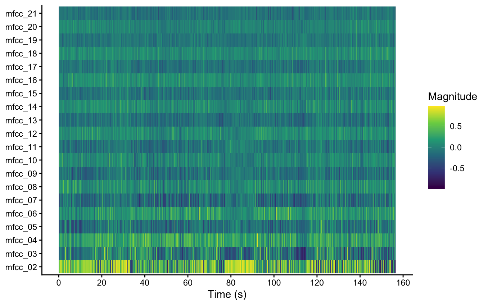
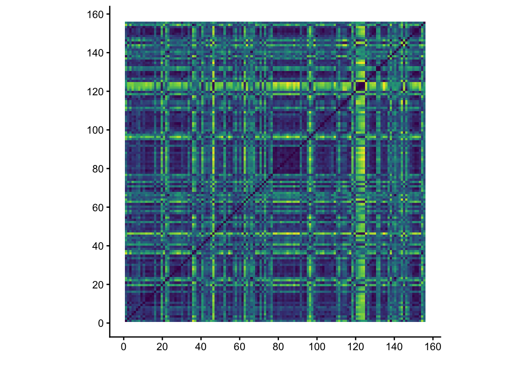
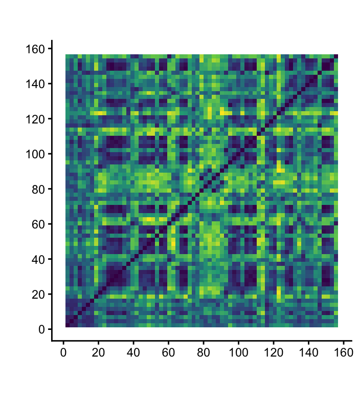

# Welcome to Computational Musicology!

## Column {width="40%"}

::: card
Welcome yada yadda ayyy
:::

::: card
Second row ayyy
:::

## Column {width=60%} {.tabset}

::: {.card title="Chart 1"}
I am trying to add a column to the right
:::

::: {.card title="README"}
This is my text to accompany my visualizations.

I made a number of visualizations for four songs, all uploaded to my Github. These songs are: "On Sight" and "Say You Will" by Kanye West, and "The Motion" and "10 Bands" (spelled ten_bands in files for organization) by Drake.

Here are some interesting observations:

In the graph below this paragraph, which is an MFCC for the timbre of "On Sight", something really cool is present. From my research, MFCC 2 generally correlates to speech, as it focuses in on a formant that indicates the type of sound produced by people speaking. This MFCC actually seems to show the most activity when Kanye is not speaking. I believe this is because the bass in the song, which you can very easily hear in the intro, has a huge "wah" effect to it, where a bandpass filter sweeps up, changing the frequency content, sounding much like a human. This is the same effect frequently used by guitarists with a wah pedal, which makes the guitar sound like it speaks. You can clearly see MFCC 2's association with the bass at 0:50 in the song - MFCC 2 has a tiny yellow peak in between 40 and 60 seconds on the graph. In this section, the bass disappears mostly (compared to the main riff). However, at 0:50, the bass plays a singular note that matches the small yellow peak there.

The next graph is a self-similarity matrix that follows the timbre of "On Sight" with a Euclidean normalization and cosine distance. This song has a distinct middle section at 1:16, where a brief sample from a children's choir plays. In this SSM, you can clearly see a strong patch of dark around this section. There is also a noteable yellow/green bar right at 120 seconds, where the song goes pretty quiet aside from the main synth riff that plays throughout the whole song. This is the most similar to the rest of the song, as other sections may have Kanye's voice or drums playing or the bass playing, or all of those at once, while the synth riff pretty much never goes away at all. What is weird about this yellow line is that it still displays heavy similarity to the children's choir at 80 seconds, which I am not sure how to make sense of. This appears in all the timbre SSM's I made.

The final graph is a chroma-based SSM, and matches somewhat well with the previous SSM, but weirdly shows a high level of similarity to the whole song during the choir section at 80 seconds, even though this is easily the most unusual part of the song. As far as my ears tell me, the choir is indeed in the same key. My best guess would be that the choir, with its harmonies and melodies, embodies a greater tonal character than much of the rest of the song, which has Kanye's voice all over it. It is perhaps the case that the SSM is latching onto the repeated riff as a point of similarity, meanwhile all other parts of the song appear at least somewhat more distinct as Kanye's voice is obscuring pitch information as he is rapping, not singing. This is purely a guess though.

:::
